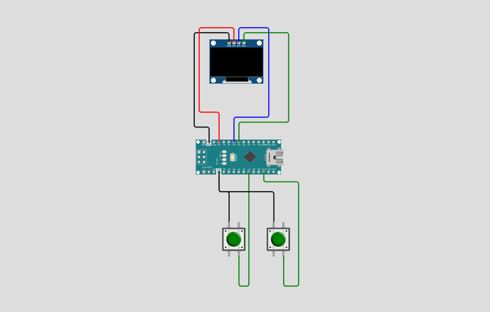

# Arduino Breakout 🦭

<p align="center">
  
</p>

<p align="center">
  
  
  
  
</p>

<p align="center">
  <a href="#overview-">Overview🦤</a> •
  <a href="#features-">Features✨</a> •
  <a href="#installation-">Installation🐧</a> •
  <a href="#hardware-">Hardware🪿</a> •
  <a href="#contribution-">Contribute🤝</a> •
  <a href="#developer-guidelines-">Developer Guidelines 🐳</a>
</p>

---

## Overview 🦭

Arduino Breakout brings the classic arcade game to your microcontroller. Control a paddle to bounce a ball and destroy bricks. When all the blocks are destroyed, you become the winner of the game. If you miss the ball, you will lose and should start again.

---

## Features 🦤

- **Classic Breakout Gameplay** - Bounce the ball and destroy all bricks
- **Smooth Graphics** - U8g2 library for crisp OLED rendering
- **Responsive Controls** - Button-based paddle movement
- **Compact & Efficient** - Runs on Arduino Nano with minimal resources
- **Game Speed Customizability** - Adjust the game speed based on your needs

---

## Installation 🐧

### Prerequisites
- **Arduino IDE 1.8.x or higher** ([Download here](https://www.arduino.cc/en/software))
- USB cable (USB-A to USB-B for Uno, or appropriate for your board)
- Git (optional, for cloning method)

---

### Method 1: Download from GitHub Release (Easiest)

#### Step 1: Download the Code
1. Visit the [Releases page](https://github.com/aydakikio/arduino_breakout/releases)
2. Click on the latest release
3. Download the **arduino_breakout.ino** file

#### Step 2: Install U8g2 Library
1. Open **Arduino IDE**
2. Go to **Sketch → Include Library → Manage Libraries...**
3. Search for `U8g2`
4. Install **U8g2 by olikraus**

#### Step 3: Open the Project
1. **File → Open**
2. Select `arduino_breakout.ino`

#### Step 4: Configure Arduino
1. Connect Arduino via USB
2. **Tools → Board → Arduino Uno**
3. **Tools → Port** → Select your Arduino port

#### Step 5: Upload
1. Click **Upload** (→) or press `Ctrl+U`
2. Game starts immediately!

---

### Method 2: Clone from GitHub

```bash
# Clone repository
git clone https://github.com/aydakikio/arduino_breakout.git
cd arduino_breakout/

# Open in Arduino IDE
# File → Open → source_code/arduino_breakout.ino
```

Then follow Steps 2-5 from Method 1.

---

## Hardware 🪿

### Required Components
- **Arduino Nano** (or compatible)
- **128x64 OLED Display** (SSD1306/SH1106, I2C)
- **2x Push Buttons**
- **Breadboard and jumper wires**

### Wiring

<p align="center">
  
</p>

---

## Known Issues 🐛

- **Display flickering** - Some clone boards may flicker. Try adjusting the U8g2 constructor or adding delay in the game loop
- **Button debounce** - Rapid presses may register multiple times. Add 0.1µF capacitors across buttons
- **Memory constraints** - Arduino Uno has 2KB SRAM. Complex modifications may cause instability
- **I2C address** - If display doesn't initialize, try address 0x3D instead of 0x3C in the code

---

## Contribution 🤝

We welcome contributions from the community. Before submitting, please review the guidelines below to ensure your contribution can be integrated smoothly.

### How to Contribute

**For Code Contributions:**
1. Clone the repository: `git clone https://github.com/aydakikio/arduino_breakout.git`
2. Create a feature branch: `git checkout -b feature/descriptive-name`
3. Implement your changes following the coding standards in Developer Guidelines
4. Test thoroughly on physical hardware
5. Commit with descriptive messages: `git commit -m "Fix: Resolve paddle boundary collision issue"`
6. Push to your branch: `git push origin feature/descriptive-name`
7. Submit a Pull Request with a clear description of changes and testing performed

**Pull Request Requirements:**
- Code compiles without warnings
- Tested on actual Arduino hardware
- Follows existing code style and naming conventions
- Includes comments for complex logic
- No debug code or commented-out sections

---

### Bug Reports 🐛

When reporting bugs, provide complete technical details to enable efficient reproduction and resolution.

**Required Information:**

```markdown
## Bug Description
[Clear, concise description of the issue]

## Reproduction Steps
1. [First step]
2. [Second step]
3. [Additional steps...]

## Expected Behavior
[What should happen]

## Actual Behavior
[What actually happens]

## Hardware Configuration
- **Board:** [Arduino Uno R3 / Nano / Mega 2560]
- **Display Controller:** [SSD1306 / SH1106]
- **Display Resolution:** [128x64 / 128x32]
- **Interface:** [I2C (address: 0x3C/0x3D) / SPI]
- **Buttons:** [Pin configuration and wiring]

## Software Environment
- **Arduino IDE:** [Version number, e.g., 1.8.19 / 2.0.3]
- **U8g2 Library:** [Version, e.g., 2.34.22]
- **Board Package:** [Version if using third-party boards]
- **OS:** [Windows 10 / macOS 13 / Ubuntu 22.04]

## Build Information
- **Sketch Size:** [e.g., 18,432 bytes (56%) of program storage]
- **Global Variables:** [e.g., 1,247 bytes (60%) of dynamic memory]
- **Compiler Warnings:** [Yes/No - include if present]

## Serial Output / Error Messages

[Paste any error messages or serial monitor output here]

## Additional Context
- Modified code sections (if any)
- Intermittent or consistent occurrence
- Photographs of physical setup
- Logic analyser captures (for timing issues)
- Relevant oscilloscope readings (for hardware issues)

## Attempted Solutions
[What you've already tried to fix the issue]
```

---

### Feature Requests

For new features, open an issue describing:
- Use case and benefits
- Proposed implementation approach
- Memory/performance impact assessment
- Hardware compatibility considerations

---

### Contribution Areas

**High Priority:**
- Performance optimizations
- Memory usage reduction
- Hardware compatibility fixes
- Critical bug fixes

**Accepted Contributions:**
- New gameplay features
- Additional display driver support
- Control scheme alternatives
- Sound/buzzer integration
- Score persistence (EEPROM)
- Level progression systems

**Documentation:**
- Wiring diagrams and schematics
- Troubleshooting guides
- Platform-specific setup instructions
- Code architecture documentation

---

## Developer Guidelines 🐳

### Code Structure
```cpp
// Hardware configuration
// Constants (#define)
// Game state variables
// Structs (Block, Ball)
// Game objects
// Functions
```

### Naming Conventions
- **Variables:** `snake_case` (player_pedal, blocks_remaining)
- **Constants:** `SCREAMING_SNAKE_CASE` (MAX_BLOCKS, BTN_RIGHT)
- **Functions:** `snake_case` (draw_game, check_block_collisions)
- **Structs:** `PascalCase` (Block, Ball)

### Key Structures
```cpp
struct Block {
  int x, y;      // Position
  int w, h;      // Size
  bool active;   // In play?
};

struct Ball {
  int x, y;      // Position
  int vx, vy;    // Velocity
  int r;         // Radius
};
```

### Core Patterns

**Collision Detection:**
```cpp
if(ball.x + ball.r >= block.x && 
   ball.x - ball.r <= block.x + block.w &&
   ball.y + ball.r >= block.y && 
   ball.y - ball.r <= block.y + block.h) {
  // Handle collision
}
```

**Input Handling:**
```cpp
void handle_pedal_controls() {
  if(digitalRead(BTN_LEFT) == LOW) {
    if(player_pedal.x <= 0) return;  // Boundary check
    player_pedal.x -= PEDAL_SPEED;
  }
}
```

**Game Loop:**
```cpp
void draw_game() {
  handle_pedal_controls();          // Every frame
  
  if(millis() - lastUpdateTime >= UPDATE_INTERVAL) {
    ball_pysics();                   // Fixed timestep
    lastUpdateTime = millis();
  }
  
  u8g2.firstPage();
  do {
    // Draw everything
  } while(u8g2.nextPage());
}
```

### Best Practices

**Memory Management:**
- Arduino Uno: 32KB Flash, 2KB SRAM
- Use `const` for constants (saves SRAM)
- Keep SRAM usage < 80%
- Avoid `String` class, use `char[]`

**Performance:**
- Use `millis()` for timing, never `delay()`
- Controls update every frame
- Physics update at fixed intervals
- Always check boundaries before movement

**U8g2 Display:**
```cpp
U8G2_SH1106_128X64_NONAME_2_HW_I2C u8g2(U8G2_R3, -1, A5, A4);
// U8G2_R3 = 270° rotation
// -1 = no reset pin
```

### Testing Checklist
- [ ] Compiles without errors/warnings
- [ ] SRAM usage < 80%
- [ ] Tested on actual hardware
- [ ] Button response is smooth
- [ ] Collisions work correctly
- [ ] Win/lose states tested
- [ ] No debug code left in

### Common Pitfalls
❌ Don't use `delay()` in game loop  
❌ Don't forget boundary checks  
❌ Don't hardcode values  

✅ Use `millis()` for timing  
✅ Always validate movement  
✅ Use `#define` constants  

---
<p align="center">
  <a href="#arduino-breakout-">Back to top ↑</a>
</p>
